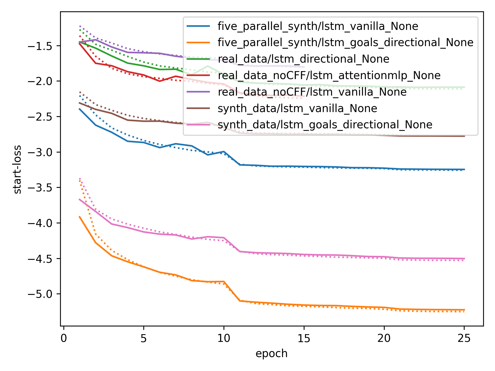
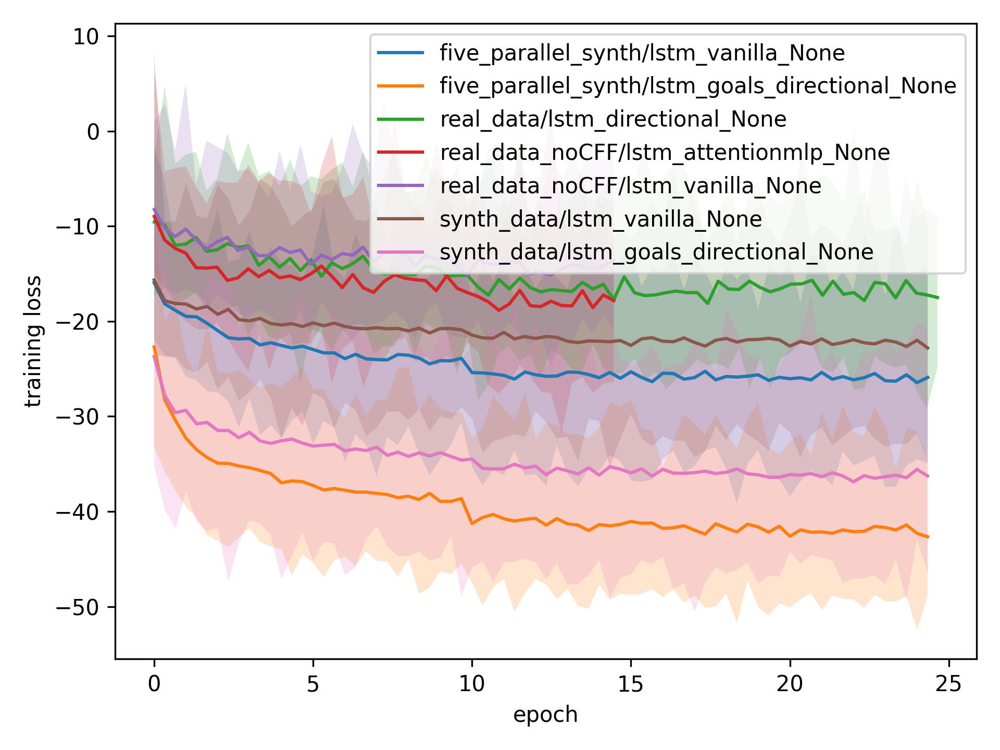
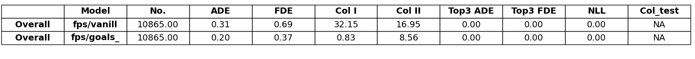
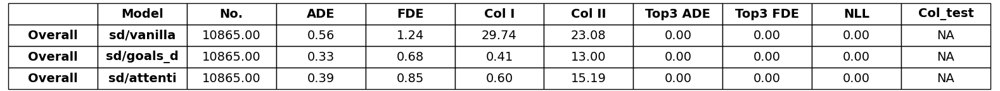
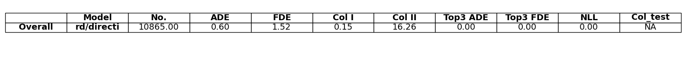
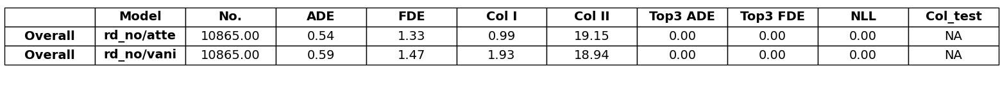

Milestone 1: Getting Started
============================

**Group B:** Paula Vogg, Danya Li, Felix Hoppe

In this readme, we present the results of our insightful struggle through the first part of the DLAV project. 

Ressources
----------

Tutorial: `Link <https://thedebugger811.github.io/posts/2021/04/milestone_1/>`_  

Trajnet++ Baselines Repository: `Link <https://github.com/vita-epfl/trajnetplusplusbaselines/>`_  

Approach
========

Here is what we did: 

* In a first step, we went through the setup process on our local machine. We trained some simple models (vanilla LSTM, directional LSTM) on a small data set (five_parallel_synth_split). Furthermore, we evaluated these models and plotted statistics and predictions.
* In a second step, we went once more through the setup process, but this time on the EPFL SCITAS server. After becomming Masters of the command line, we managed to run the same training jobs as we did previously on our local machine - showing that everything works just fine.
* Next, we trained a number of models on different data. We used both our local machines as well as SCITAS to run these trainings. A list of all trained models can be found in the *Results* section.
* In a next step, we evaluated the different models. While using the extensive scoring of *Trajnet++*, we also plotted the model predictions in different situations. For more details, see *Results*.
* Finally, we picked our best performing model, and uploaded an submission to `AICrowd <https://www.aicrowd.com/challenges/trajnet-a-trajectory-forecasting-challenge>`_.

Results
=======

Motivated as we are, we trained the following models (organized by training data set):

*five_parallel_synth*

- vanilla
- directional

*synth_data*

- vanilla 
- directional 
- attentionmlp (canceled, took too long) 

*real_data*
 
- attentionmlp (canceled, took too long)

*real_data_noCFF* (subset of real_data)

- vanilla
- directional
- attentionmlp

Training statistics
-------------------

Considering the two plots above, we can note several things:

- The loss decreases for all models. This implies that all models are able to learn from the data.
- There is a jump in the performance improvement after epoch 10. This coincides with the scheduled decrease of the learning rate after epoch 10. The second learning rate decrease after epoch 20 has no major effect.
- The standard deviation of the loss function remains quite large throughout the training.

Evaluation
----------

Models trained on **five_parallel_synth** data

Models trained on **synth_data** data

Models trained on **real_data_noCFF** data

All models have been tested on the *five_parallel_synth/test_private* data. 

Visualizing predictions
-----------------------

Below, predictions of trained models in 5 different situations are shown:

AICrowd submission
==================

Our AICrowd submission can be found here [LINK]

Reference
=========

The used Trajnet++ Baseline code has been developed by

.. code-block::

    @article{Kothari2020HumanTF,
      title={Human Trajectory Forecasting in Crowds: A Deep Learning Perspective},
      author={Parth Kothari and S. Kreiss and Alexandre Alahi},
      journal={ArXiv},
      year={2020},
      volume={abs/2007.03639}
    }

